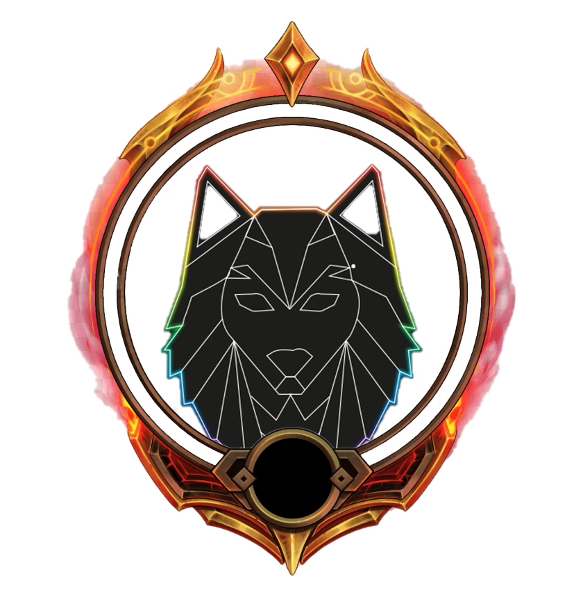

<a name="readme-top"></a>

[![Contributors][contributors-shield]][contributors-url]
[![Forks][forks-shield]][forks-url]
[![Stargazers][stars-shield]][stars-url]
[![Issues][issues-shield]][issues-url]
[![MIT License][license-shield]][license-url]
[![Version][version-shield]][version-url]

<!-- PROJECT LOGO -->
<br />
<div align="center">
  <a href="https://github.com/ArvidWedtstein/Memebot">
    
  </a>

  <h3 align="center">Memebot</h3>

  <p align="center">
    Discord bot
    <br />
    <a href="https://github.com/ArvidWedtstein/Memebot"><strong>Explore the docs »</strong></a>
    <br />
    <br />
    <a href="https://discord.com/oauth2/authorize?client_id=787324889634963486&scope=bot&permissions=10200548352">Add to server</a>
    ·
    <a href="https://github.com/ArvidWedtstein/Memebot/issues">Report Bug</a>
    ·
    <a href="https://github.com/ArvidWedtstein/Memebot/issues">Request Feature</a>
  </p>
</div>


<!-- TABLE OF CONTENTS -->
<details>
  <summary>Table of Contents</summary>
  <ol>
    <li>
      <a href="#about-the-project">About The Project</a>
      <ul>
        <li><a href="#built-with">Built With</a></li>
      </ul>
    </li>
    <li>
      <a href="#getting-started">Getting Started</a>
      <ul>
        <li><a href="#prerequisites">Prerequisites</a></li>
        <li><a href="#installation">Installation</a></li>
      </ul>
    </li>
    <li><a href="#usage">Usage</a></li>
    <li><a href="#roadmap">Roadmap</a></li>
    <li><a href="#contributing">Contributing</a></li>
    <li><a href="#license">License</a></li>
    <li><a href="#contact">Contact</a></li>
    <li><a href="#acknowledgments">Acknowledgments</a></li>
  </ol>
</details>


<!-- ABOUT THE PROJECT -->
## About The Project


This is a discord bot that i made for my discord server. It has a lot of features and is still in development. I will add/fix more features in the future.

This project started first out as a hobby project back in 2020. Back then the bot was written in JS. Since then the bot has gone through a complete rewrite in TypeScript. The bot is still kind of in development. 

Here's why i made this project:
* I needed something to do in my freetime
* I wanted to learn the Discord API


<p align="right">(<a href="#readme-top">back to top</a>)</p>


### Built With

This project is mainly written in TypeScript, together with these frameworks and libraries:

<!-- * [![DiscordJS][DiscordJS]][Discordjs-url]
* [![MongoDB][MongoDB]][MongoDB-url] -->

<div align="left">
  

  
</div>
<p align="right">(<a href="#readme-top">back to top</a>)</p>


<!-- GETTING STARTED -->
## Getting Started


To get a local copy up and running follow these simple steps.

### Prerequisites

To run this project you'll need to have nodejs installed on your computer. You can download it [here](https://nodejs.org/en/download/)

Get latest npm version
* npm
  ```sh
  npm install npm@latest -g
  ```

### Installation


1. Clone the repo
   ```sh
   git clone https://github.com/ArvidWedtstein/Memebot.git
   ```
2. Install NPM packages
   ```sh
   npm install
   ```
3. Go to Discord Developer Portal and create a new application [here](https://discord.com/developers/applications) (if you already have one, skip this step)
3. Create a .env file in the root directory and add your bot token and mongodb connection string
   ```JS
   TOKEN=YOUR_TOKEN
   REMOTE_MONGODB=YOUR_MONGO_CONNECTION_STRING
   ```
4. Run the bot
   ```sh
   npm run startts
   ```

<p align="right">(<a href="#readme-top">back to top</a>)</p>

### Deploying
Deploying image to scaleway:

1. build the docker image
   ```sh
   docker build -t memebot .
   ```
2. pull docker image 
   ```sh
   docker pull ubuntu:latest
   ```
3. tag the image
    ```sh
    docker tag memebot arvidwedtstein/memebot:latest
    ```
4. push the image to docker hub
    ```sh
    docker push arvidwedtstein/memebot:latest
    ```

<!-- USAGE EXAMPLES -->
## Usage

So the bot has a couple of features. Most of them are listed here:

* Economy System
    * This system lets you earn trade coins with other users. These can be earned by leveling up. You can use these coins to buy items in the inventory system.
* Level System
    * This system lets you level up by chatting in the server. These levels act as a hierarchy. The higher your level, the more coins you earn and more permissions you get.
    * Levels can be customly set by the server owner.
* Inventory System
    * Buy a variety of items with ErlingCoins
    * Trade items with other users
    * Has some basic items like gifflar
* Fun Commands
    * Tic-Tac-Toe
    * Rock-Scissors-Papers
    * Dice
    * Blackjack
    * Compare yourself to other users
    * And much more
* Moderation System
    * Kick
    * Ban
    * Mute
    * Warn
    * And much more
* Ticket Support System
    * This system lets your users create a ticket for if they have any kind of problem.
* Music System (currently not functional)
    * Play music from youtube
    * Queue songs
    * Skip songs
    * And much more
* Birthday System
    * Set your birthday
    * Get a small reward on your birthday
* Brawlhalla Reward Storing System
    * Store your brawlhalla rewards
    * Use them later
* Brawlhalla System
    * Subscribe to brawlhalla streams
    * Get notified when there is a new brawlhalla stream on twitch
* Localization System
    * Translates text to the selected language in guild settings
* And much more


<p align="right">(<a href="#readme-top">back to top</a>)</p>


<!-- ROADMAP -->
## Roadmap

- [x] Get to know the Discord API
- [x] Host the bot on a server
- [X] Add more features
- [X] Update bot to Discord.js v13 and rewrite the code in typescript
- [X] Multi-language Support (partually)
    - [X] English
    - [X] German
    - [X] Norwegian
    - [ ] French (on the way)
- [ ] Update bot to Discord.js v14
- [ ] Optimize database queries


See the [open issues](https://github.com/ArvidWedtstein/Memebot/issues) for a full list of proposed features (and known issues).

<p align="right">(<a href="#readme-top">back to top</a>)</p>


<!-- CONTRIBUTING -->
## Contributing

Any contributions you make are **greatly appreciated**.

If you have a suggestion that would make this project better, please fork the repo and create a pull request. You can also simply open an issue with the tag "enhancement".
Don't forget to give the project a star! <3 

1. Fork the Project
2. Create your Feature Branch (`git checkout -b feature/AmazingFeature`)
3. Commit your Changes (`git commit -m 'Add some AmazingFeature'`)
4. Push to the Branch (`git push origin feature/AmazingFeature`)
5. Open a Pull Request

<p align="right">(<a href="#readme-top">back to top</a>)</p>


<!-- LICENSE -->
## License

Distributed under the MIT License. See `LICENSE.txt` for more information.

<p align="right">(<a href="#readme-top">back to top</a>)</p>


<!-- CONTACT -->
## Contact

Invite the bot to your server [here](https://discord.com/oauth2/authorize?client_id=787324889634963486&scope=bot&permissions=10200548352)

<p align="right">(<a href="#readme-top">back to top</a>)</p>


<!-- ACKNOWLEDGMENTS -->
## Acknowledgments

I would like to give credit to these packages / APIs that helped me with this project:

* [Brawlhalla API](https://www.brawlhalla.com/)
* [Metrologisk Institutt API](https://developer.yr.no/)
* [Open Weather Map API](https://openweathermap.org/api)
* [Bring API](https://developer.bring.com/)
* [ISS Location API](https://wheretheiss.at/w/developer)
* [Dictionary API](https://dictionaryapi.dev/)
* [Meme API](https://meme-api.herokuapp.com/)
* [Discord API](https://discord.com/developers/docs/intro)
* [NASA API](https://api.nasa.gov/)
* [Clash Of Clans API](https://developer.clashofclans.com/)
* [Clash Royale API](https://developer.clashroyale.com/)
* [Twitch API](https://dev.twitch.tv/docs/api/)
* [MomentJS](https://momentjs.com/)


<p align="right">(<a href="#readme-top">back to top</a>)</p>


<!-- MARKDOWN LINKS & IMAGES -->
[contributors-shield]: https://img.shields.io/github/contributors/ArvidWedtstein/Memebot.svg?style=for-the-badge
[contributors-url]: https://github.com/ArvidWedtstein/Memebot/graphs/contributors
[forks-shield]: https://img.shields.io/github/forks/ArvidWedtstein/Memebot.svg?style=for-the-badge
[forks-url]: https://github.com/ArvidWedtstein/Memebot/network/members
[stars-shield]: https://img.shields.io/github/stars/ArvidWedtstein/Memebot.svg?style=for-the-badge
[stars-url]: https://github.com/ArvidWedtstein/Memebot/stargazers
[issues-shield]: https://img.shields.io/github/issues/ArvidWedtstein/Memebot.svg?style=for-the-badge
[issues-url]: https://github.com/ArvidWedtstein/Memebot/issues
[license-shield]: https://img.shields.io/github/license/ArvidWedtstein/Memebot.svg?style=for-the-badge
[license-url]: https://github.com/ArvidWedtstein/Memebot/blob/master/LICENSE.txt
[version-shield]: https://img.shields.io/github/package-json/v/arvidwedtstein/Memebot?style=for-the-badge
[version-url]: https://github.com/ArvidWedtstein/Memebot
[DiscordJS]: https://img.shields.io/badge/discord.js-000000?style=for-the-badge&logo=discord&logoColor=white
[Discordjs-url]: https://discord.com/developers/docs/intro
[MongoDB]: https://img.shields.io/badge/MongoDB-000000?style=for-the-badge&logo=mongodb&logoColor=white
[MongoDB-url]: https://www.mongodb.com/

<!-- DEPLOY: docker build . -t memebot -->

